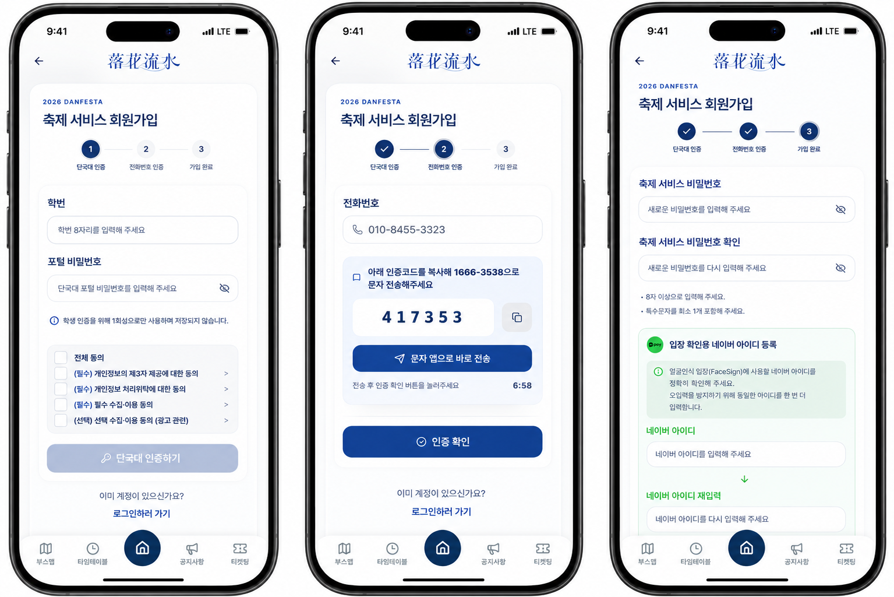

<div align="center">


<br /><br />

**단국대 봄 축제를 위해 직접 만들고, 실제로 운영한 서비스입니다.**

<br />

[](https://react.dev)
[](https://www.typescriptlang.org)
[](https://spring.io/projects/spring-boot)
[](https://kafka.apache.org)
[](https://redis.io)
[](https://www.nhncloud.com)

</div>

---

## 팀

| 이름 | 학번 | 역할 |
|:---:|:---:|---|
| 강하늘 | 32230120 | 팀장 · 관리자 페이지 전반 설계 및 개발, 긴급·일반 공지사항 등록·수정·삭제 기능, 광고 배너 등록 및 노출 순서 관리 |
| 박주희 | 32221902 | 티켓팅 대기열 시스템, 팔찌 배부 관리 플랫폼, 회원 탈퇴·비밀번호 재설정 개발 |
| 박지우 | 32211862 | JWT 기반 회원 인증, 로그인·회원가입, Redis 대기열 티켓 예매 시스템 개발 |
| 조하은 | 32234364 | 축제 메인 홈 화면(포스터·라인업·현재 공연 섹션), 캠퍼스 지도 기반 부스맵(날짜·단과대 필터), 지도 편집 기능, 공연 일정 타임테이블 개발 |

---

## 어떤 서비스인가요?

총학생회와 직접 미팅하면서 만든 단국대 축제 앱입니다.

기존에는 공연 정보는 인스타그램, 티켓은 오픈카톡, 부스 위치는 에브리타임에 올라오다 보니
학생들이 이리저리 찾아다녀야 했고 운영진도 같은 내용을 여러 곳에 올려야 했습니다.

그래서 만들었습니다. 공연, 부스, 티켓, 공지 전부 한 앱에서.

---

## 시연 영상

[](https://www.youtube.com/watch?v=ZrvDs-fHCjw)

---

## 서비스 화면

**사용자 화면**

| 홈 | 타임테이블 | 부스맵 |
|:---:|:---:|:---:|
|  |  |  |

| 티켓팅 대기열 | 내 티켓 | 공지사항 |
|:---:|:---:|:---:|
|  |  |  |

**회원가입**



**관리자 화면**

| 공지 관리 | 광고 등록 | 팔찌 배부 |
|:---:|:---:|:---:|
|  |  |  |

---

## 시스템 아키텍처


---

## 서비스 아키텍처 (티켓팅)


오픈 순간 수천 명이 동시에 들어오는 상황을 고려해서 설계했습니다.

```
요청 → Redis 대기열 → Lua Script로 선착순 처리 → Kafka로 티켓 발급
                                                  → 실패하면 자동 보상
```

---

## 실제 운영 결과

> 2026년 5월 7일 티켓팅 오픈 기준 실측 데이터

| | |
|---|---|
| 동시 접속자 | **4,500명** |
| 티켓 소진 시간 | **1분 만에 3,500장 전량 매진** |
| 중복 발급 / 순번 오류 | **ZERO** |
| CPU 사용률 | **약 40%** (16vCPU, 64GB 기준) |
| queue_enter 평균 응답속도 | **498ms** |
| 서버 Overflow | **0건** |

**트래픽 현황**


---

## 사용자 데이터

> 축제 기간 기능별 실제 사용 현황


| 기능 | 조회수 |
|---|---|
| 타임테이블 | 8,146회 |
| 티켓팅 | 7,356회 |
| 내 티켓 | 5,897회 |
| 부스맵 | 4,303회 |
| 공지사항 | 3,528회 |

---

## 사용자 피드백


---

## 기술 스택

**Frontend** — React 18, TypeScript, Vite, Tailwind CSS, TanStack Query

**Backend** — Spring Boot 3, Kafka, Redis, MySQL, Prometheus / Grafana

**Infra** — NHN Cloud, Docker, RDS HA, EasyCache

---

## 레포지토리

| | |
|---|---|
| [Danzzan-FE](https://github.com/DKU-Dan-Zzan/Danzzan-FE) | 프론트엔드 |
| [Danzzan-BE](https://github.com/DKU-Dan-Zzan/Danzzan-BE) | 백엔드 |
| [Danzzan-Ticket-BE](https://github.com/DKU-Dan-Zzan/Danzzan-Ticket-BE) | 티켓팅 서버 |

---

<div align="center">
단국대학교 컴퓨터공학과 캡스톤디자인 2026
</div>
